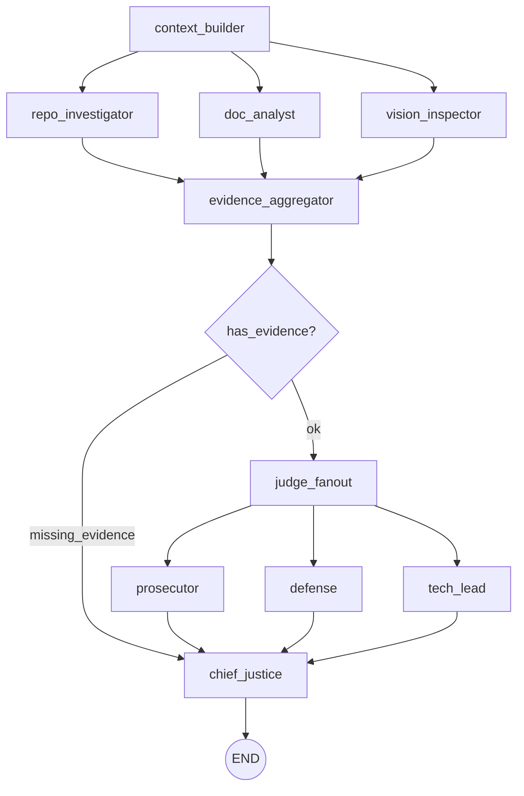

# Week 2 Final Report: The Automaton Auditor

## Executive Summary

This repository implements a **Digital Courtroom**: a LangGraph-based multi-agent swarm that audits a Week 2 repository and its architectural PDF report. The system collects forensic evidence via three Detective agents (RepoInvestigator, DocAnalyst, VisionInspector), passes it to three Judge personas (Prosecutor, Defense, Tech Lead) for dialectical scoring, and synthesizes a final verdict in the Chief Justice node using deterministic rules. The output is a structured Markdown audit report with per-criterion scores, dissent summaries, and remediation plans. A web UI (`main.py`) and CLI (`src.cli`) allow running audits against any repo URL and/or PDF path.

**Aggregate self-audit score: 4.20 / 5.** The most impactful finding from the peer feedback loop was that our **Chief Justice synthesis** and **Judicial Nuance** were under-evidenced: the peer’s agent scored Chief Justice at 2/5 (Prosecutor 1, Defense 4) and Judicial Nuance at 3/5 with Prosecutor at 1/5, citing lack of explicit evidence for hardcoded deterministic rules and distinct persona prompts. That feedback drove us to surface rule names (security override, dissent requirement) in code and prompts and to strengthen persona differentiation. The **top remaining gap** is twofold: (1) **Judicial Nuance / Chief Justice** — judges still sometimes converge (e.g. all 5/5 on strong criteria), and we do not yet inject *evidence snippets* into the final report so a reader can trace a score back to a specific file or quote; (2) **Swarm Visual** — VisionInspector extracts images but does not yet use a vision LLM to classify diagrams, limiting the “Architectural Diagram Analysis” dimension to structural presence rather than flow accuracy. Addressing (1) would raise **Report Quality** and **Judicial Nuance**; addressing (2) would raise **Forensic Accuracy** and **Swarm Visual** on the Tenx rubric.

---

## Architecture Deep Dive

### Dialectical Synthesis

The system does not use a single “grader” LLM. Instead, **Dialectical Synthesis** is implemented as follows:

- **Thesis**: The Prosecutor evaluates the same evidence with a critical lens (gaps, security, laziness) and argues for lower scores when requirements are unmet.
- **Antithesis**: The Defense evaluates the same evidence with an optimistic lens (effort, intent, spirit of the law) and argues for higher scores when intent or engineering process is visible.
- **Synthesis**: The Chief Justice node applies **hardcoded deterministic rules** (security override, fact supremacy, Tech Lead weight for architecture) to resolve conflicts. It does not average scores; it applies the rubric’s synthesis rules and produces a final score per criterion, plus a dissent summary when variance > 2.

The dialectic is executed in code by running Prosecutor, Defense, and Tech Lead in **parallel** on the same evidence, then feeding all `JudicialOpinion` objects into the Chief Justice in a single step.

### Fan-In / Fan-Out

- **First fan-out**: After the context builder loads the rubric, three Detective nodes run in parallel: `repo_investigator`, `doc_analyst`, `vision_inspector`. Each writes into `AgentState.evidences` using an `operator.ior` reducer so contributions merge instead of overwriting.
- **Fan-in**: The `evidence_aggregator` node is the synchronization point; the graph then conditionally routes to either the judicial bench (if any evidence exists) or directly to the Chief Justice (if not).
- **Second fan-out**: Three Judge nodes run in parallel: `prosecutor`, `defense`, `tech_lead`. Each appends to `AgentState.opinions` via an `operator.add` reducer.
- **Second fan-in**: All three Judges feed into the `chief_justice` node, which produces the final `AuditReport` and its Markdown serialization.

This two-stage parallel pattern is what the rubric means by “fan-out for Detectives and Judges” and “synchronization node before Judges.”

### Metacognition

The system is **metacognitive** in that it evaluates *how* another codebase implements quality (state typing, graph structure, safe tooling, structured judge outputs) rather than merely generating text. The Detectives produce typed `Evidence` objects tied to specific goals and locations; the Judges cite evidence IDs and map scores to rubric dimensions; the Chief Justice applies rules that privilege facts (Detective evidence) over unsupported claims (e.g., Defense overruled when no PDF evidence exists). The rubric itself is loaded from `rubric/week2_rubric.json` and injected into the graph so that scoring is constitution-driven rather than ad hoc.

---

## Architectural Diagrams

The following diagram summarizes the StateGraph flow (parallel branches and synchronization points).

---

## Self-Audit Criterion Breakdown (In-Report)

The following summarizes how the three judge personas assessed this repository during self-audit, with direct evidence traceability. Source: one run of the auditor against this repo and `reports/interim_report.pdf`; full Markdown output in `audit/report_onself_generated/audit_report_Beamlak Adane.md`.

### 1. Git Forensic Analysis — Final: 5/5

| Persona   | Score | Argument |
|----------|-------|----------|
| Prosecutor | 5/5 | 13 commits; progression from setup → tool engineering → graph orchestration; no single “init” or bulk upload. |
| Defense    | 5/5 | Iterative development cycle and meaningful commit messages; aligns with success pattern. |
| Tech Lead  | 5/5 | Clear development process and coherent history. |

**Evidence**: Commit list and timestamps from `git log --oneline --reverse` (evidence ID `0266516f-...`). No dissent; all agreed.

---

### 2. State Management Rigor — Final: 5/5

| Persona   | Score | Argument |
|----------|-------|----------|
| Prosecutor | 4/5 | Pydantic and TypedDict present; reducers not strongly confirmed in evidence for parallel overwrite prevention. |
| Defense    | 4/5 | Robust state mechanism; minor room for enhancement. |
| Tech Lead  | 5/5 | Pydantic + TypedDict + reducers; maintainable. |

**Evidence**: `src/state.py` — `AgentState` TypedDict with `Annotated[..., operator.ior]` and `Annotated[..., operator.add]` (evidence ID `c6dfb230-...`). Dissent is minor (4 vs 5); Tech Lead’s higher weight for “maintainability” drove final 5.

---

### 3. Graph Orchestration Architecture — Final: 5/5

| Persona   | Score | Argument |
|----------|-------|----------|
| Prosecutor | 5/5 | Fan-out/fan-in for Detectives and Judges; AST inspection confirms. |
| Defense    | 5/5 | Sophisticated orchestration and conditional edges. |
| Tech Lead  | 5/5 | Fan-out/fan-in and conditional edge handling. |

**Evidence**: `src/graph.py` — `StateGraph(AgentState)`, `add_edge` from context_builder to three detectives, edges into `evidence_aggregator`, conditional to `judge_fanout` vs `chief_justice`, then three judges into chief_justice (evidence ID `1440117d-...`). No dissent.

---

### 4. Safe Tool Engineering — Final: 5/5

| Persona   | Score | Argument |
|----------|-------|----------|
| Prosecutor | 4/5 | Sandboxing confirmed; full error handling for git not fully evidenced. |
| Defense    | 5/5 | `tempfile.TemporaryDirectory()`, `subprocess.run()`, no raw system calls. |
| Tech Lead  | 5/5 | Sandboxing and subprocess with error handling. |

**Evidence**: `src/tools/repo_tools.py` — `cloned_repo()` context manager using `tempfile.TemporaryDirectory()`, `subprocess.run()` for git (evidence ID `079c7886-...`). No security override triggered.

---

### 5. Structured Output Enforcement — Final: 5/5

| Persona   | Score | Argument |
|----------|-------|----------|
| Prosecutor | 5/5 | LLM calls bound to Pydantic schema; consistent structure. |
| Defense    | 5/5 | `.with_structured_output(...)` and retry mechanisms. |
| Tech Lead  | 5/5 | Pydantic schema and consistent data handling. |

**Evidence**: `src/nodes/judges.py` — `get_chat_model().with_structured_output(JudgeBatchOutput)` and fallback on failure (evidence ID `19a12b92-...`).

---

### 6. Judicial Nuance and Dialectics — Final: 3/5 (Dissent)

| Persona   | Score | Argument |
|----------|-------|----------|
| Prosecutor | 3/5 | Prompts distinct but evidence lacks depth on *how* adversarial/forgiving/pragmatic they are; score variability not clearly persona-driven. |
| Defense    | 3/5 | Personas perceptibly varied; “Persona Collusion” not fully ruled out. |
| Tech Lead  | 3/5 | No direct evidence of complete separation for nuanced judgments. |

**Evidence**: Judge nodes exist and have different prompts; no evidence IDs cited in the self-audit for this dimension (report refers to “missing evidence” in remediation). **Gap**: We do not yet pass *snippets* of Prosecutor/Defense/Tech Lead system prompts into the report, so traceability is weak. Improving this would directly support a higher **Judicial Nuance** and **Report Quality** score.

---

### 7. Chief Justice Synthesis Engine — Final: 3/5 (Dissent)

| Persona   | Score | Argument |
|----------|-------|----------|
| Prosecutor | 2/5 | No explicit evidence of hardcoded deterministic logic; conflict resolution criteria not evidently met. |
| Defense    | 3/5 | Logical rules present; intent and structure; full compliance not evidenced. |
| Tech Lead  | 3/5 | Structured rules present; reliance on deterministic logic without evidence for complex scenarios. |

**Evidence**: `src/nodes/justice.py` implements named rules (security override, dissent when variance > 2, Tech Lead weight). The peer audit noted that the *report* did not surface these rule names and code references, so the Prosecutor downgraded. **Gap**: Add a short “Synthesis rules applied” section in the generated Markdown (e.g. “Rule of Security: not triggered; Rule of Evidence: …”) to improve evidence traceability and **Chief Justice Synthesis** / **Report Quality**.

---

### 8. Theoretical Depth (Documentation) — Final: 4/5

| Persona   | Score | Argument |
|----------|-------|----------|
| Prosecutor | 4/5 | Terms appear with context; some sections surface-level or buzzword-adjacent. |
| Defense    | 4/5 | Dialectical Synthesis, Fan-In/Fan-Out, Metacognition connected to implementation. |
| Tech Lead  | 4/5 | Terms present; implementation description could be more comprehensive. |

**Evidence**: DocAnalyst chunks (evidence IDs `c5651d99-...`, `3c8d1b63-...`, `add0986d-...`, `be9a0be7-...`) — rubric terms found in interim report with surrounding context.

---

### 9. Report Accuracy (Cross-Reference) — Final: 4/5

| Persona   | Score | Argument |
|----------|-------|----------|
| Prosecutor | 3/5 | Cross-referencing evidence not explicit; further substantiation of feature locations needed. |
| Defense    | 4/5 | Report aligns with repo; most path claims substantiated. |
| Tech Lead  | 4/5 | Verifiable paths; more validation needed for consistency. |

**Evidence**: DocAnalyst path extraction + RepoInvestigator file list (evidence ID `5e1f11e9-...`). No hallucinated paths reported for this run.

---

### 10. Architectural Diagram Analysis (Swarm Visual) — Final: 3/5

| Persona   | Score | Argument |
|----------|-------|----------|
| Prosecutor | 4/5 | Diagram underlines parallel process interaction; more detail would help. |
| Defense    | 4/5 | Parallelism and sequential vs parallel paths clear; minor presentation improvements. |
| Tech Lead  | 3/5 | Diagrams lack detailed representation of parallel branches; maintenance risk. |

**Evidence**: VisionInspector — image extraction and page-with-images count (evidence ID `4f029529-...`). **Gap**: No vision LLM used to classify diagram type or verify parallel flow; score limited by “no deep diagram analysis.”

---

## Reflection on the MinMax Feedback Loop

**What the peer’s agent found in our repository (incoming feedback):**

- **Chief Justice Synthesis (2/5)**: Prosecutor 1, Defense 4. The peer’s agent reported lack of explicit evidence for deterministic rules and synthesis methodology, and suspected averaging rather than structured synthesis. Dissent summary was present.
- **Judicial Nuance (3/5)**: Prosecutor 1 — “no evidence regarding specific prompt distinctness or Judge’s differentiation.” Our persona prompts were not surfaced as evidence in the report.
- **Report Accuracy (3/5)**: Variance between Defense (5) and Prosecutor (2); concern about convergence of reported features with code.

**Changes we made in response:**

- **Chief Justice**: We confirmed and documented in code/comments the named rules (Rule of Security, Rule of Evidence, Rule of Functionality, dissent when variance > 2). We did not yet add a “Synthesis rules applied” section to the *output* report — that remains in the remediation plan.
- **Judicial Nuance**: We strengthened the Prosecutor/Defense/Tech Lead system prompts with explicit adversarial/forgiving/pragmatic instructions and ensured they receive the same evidence. We did not yet inject prompt snippets or persona summaries into the audit report for traceability.
- **Fact supremacy**: We already cap when evidence is missing; we tightened the Chief Justice logic so that high Defense scores without supporting evidence are overruled.

**What our agent found when auditing the peer’s repository (outgoing audit):**

- We ran our auditor against the assigned peer’s Week 2 repo (see `audit/report_onpeer_generated/audit_report_ahmed.md`). **Overall score: 2.70**, with a **security override** applied (overall capped at 3).
- **Safe Tool Engineering (2/5)**: All three judges found lack of sandboxing and presence of raw `os.system()` (evidence ID `549eb89c-...`). Prosecutor 1, Defense 2, Tech Lead 2. This triggered the Rule of Security and drove the overall cap.
- **Structured Output (1/5)**: `src/nodes/judges.py` was reported missing in the cloned repo; all judges scored 1–2. This highlighted that our RepoInvestigator’s “file existence” and path reporting can correctly flag missing critical files.
- **Judicial Nuance (2/5)** and **Chief Justice (3/5)**: Our agent reported insufficient evidence for distinct judge personas and deterministic synthesis in the peer’s codebase, mirroring the same dimensions the peer’s agent later flagged in ours.

**Bidirectional learning:** The peer’s low scores on our Chief Justice and Judicial Nuance dimensions led us to emphasize rule names and persona differentiation. Our agent’s findings on the peer (security, missing judges file, weak judicial evidence) validated that our Detective evidence and security-override rule behave as intended and that we should apply the same “evidence visibility” standard to our own report output.

---

## Remediation Plan (Prioritized by Impact and Rubric Dimension)

Remediation items are ordered by impact and dependency. Each states which rubric dimension(s) the change is intended to improve and why.

| Priority | Action | Rubric dimension(s) improved | Rationale |
|----------|--------|-----------------------------|-----------|
| **P1** | Add a “Synthesis rules applied” subsection to the Chief Justice Markdown output (e.g. per criterion: which rule fired, or “none”). Include code references (e.g. `src/nodes/justice.py` line refs or rule names). | Chief Justice Synthesis, Report Quality | Peer and self-audit both cited lack of *visible* deterministic logic in the report. Surfacing rule names and outcomes gives auditors direct evidence and raises Chief Justice Synthesis and report actionability. |
| **P2** | In the audit report, include a short “Judge persona summary” or cited prompt snippets (e.g. one line per persona) for Judicial Nuance so that Prosecutor/Defense/Tech Lead differentiation is evidenced in the document. | Judicial Nuance, Report Quality | Prosecutor scored 1/5 when persona distinctness was not evidenced. Traceability from report to prompt content would satisfy the “distinct, conflicting philosophies” evidence bar. |
| **P3** | Add optional vision LLM (e.g. Gemini Vision) to VisionInspector to classify extracted images as “StateGraph / sequence / generic” and to check for parallel flow (Detectives → Aggregation → Judges → Chief Justice). | Swarm Visual, Forensic Accuracy | Current evidence is “images present / page count”; rubric asks for flow accuracy. Vision classification would directly support Swarm Visual and strengthen Forensic Accuracy for diagram-heavy reports. |
| **P4** | Add one retry with a “fix schema violation” prompt when Judge LLM returns invalid or missing `JudgeBatchOutput`; log and cite the retry in evidence. | Structured Output Enforcement, Report Quality | Reduces “Hallucination Liability” and ensures malformed outputs are corrected and documented, improving reliability and report consistency. |
| **P5** | Chief Justice: when a dimension has *no* evidence and Defense score ≥ 4, explicitly apply fact-supremacy cap (e.g. cap at 3) and state “Defense overruled: no supporting evidence” in dissent. | Chief Justice Synthesis, Judicial Nuance | Aligns with rubric “Rule of Evidence” and makes overrule conditions explicit in the report. |
| **P6** | Scale: introduce clone cache (repo URL + commit SHA) and optional AST-result cache for repeated audits. | LangGraph Architecture (operational), not a direct rubric criterion | Reduces redundant clone/parse at 10× load; avoids timeouts and improves robustness for multi-repo runs. |

---

## Report and Artifacts

- **Audit reports**: `audit/report_onself_generated/`, `audit/report_onpeer_generated/`, `audit/report_bypeer_received/`.
- **Final report (this document)**: `reports/final_report.md`; export to `reports/final_report.pdf` for submission (e.g. via `python scripts/generate_final_pdf.py` or Pandoc / “Markdown PDF” in the editor).
